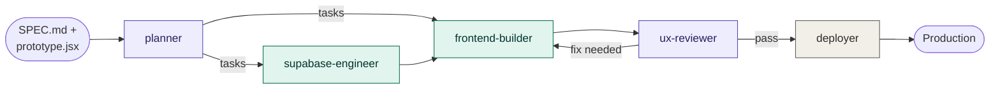
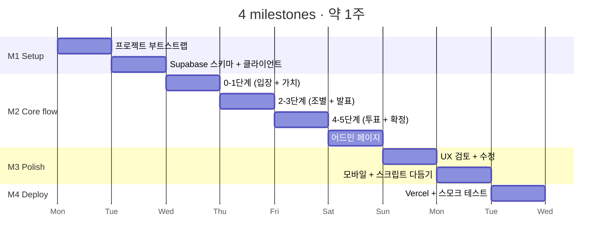
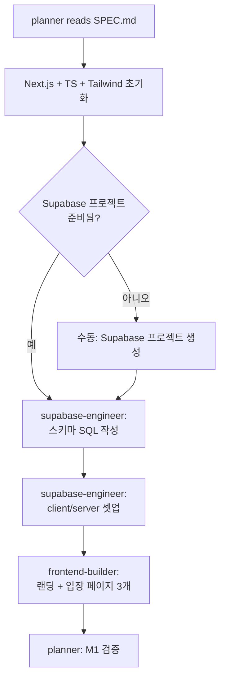
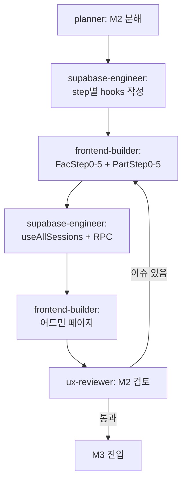
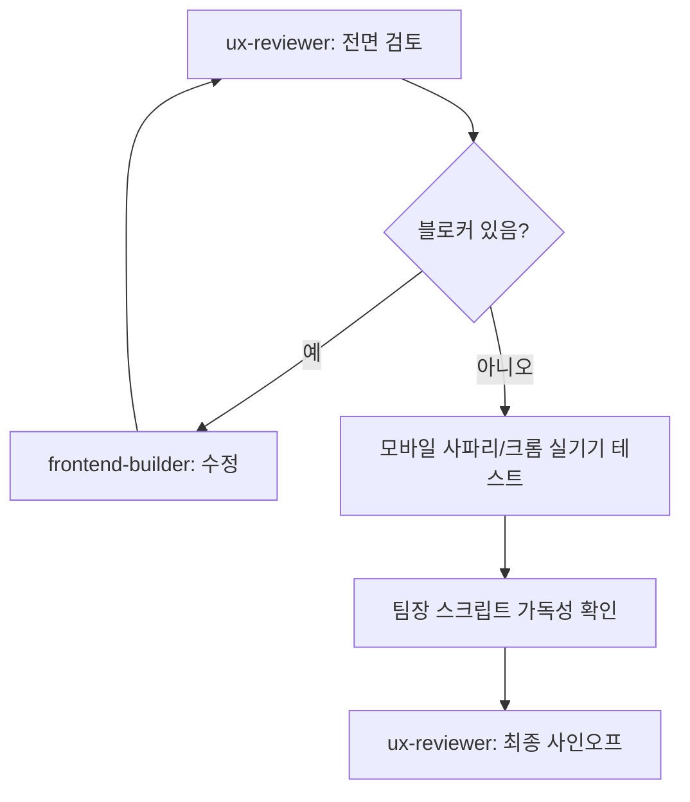
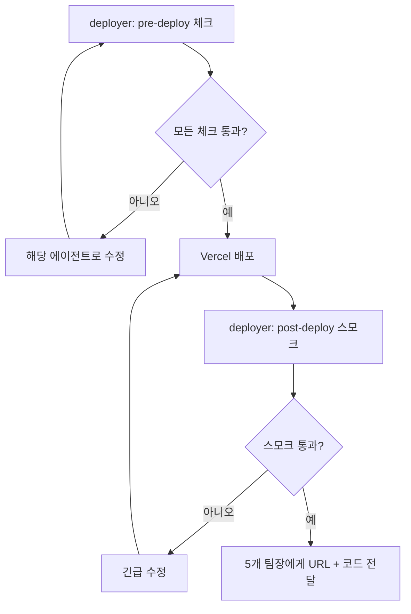
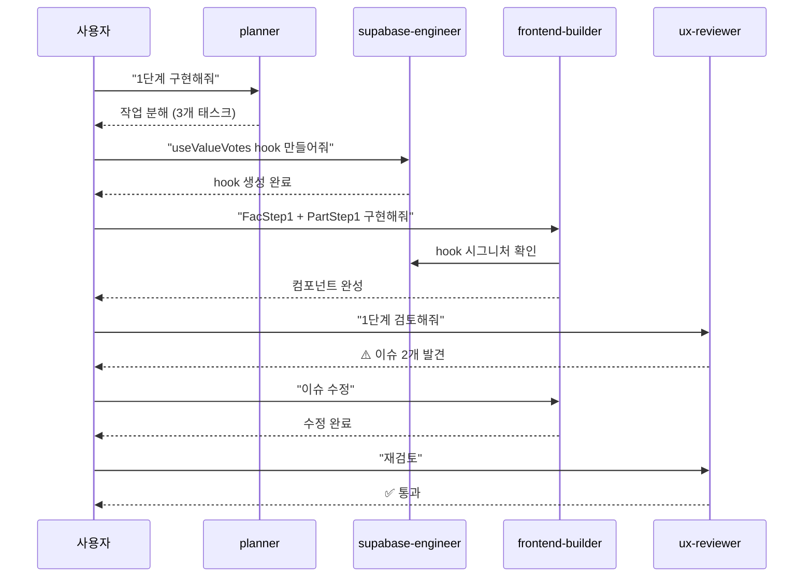

# 개발 워크플로우

> 이 문서는 Claude Code가 5개 서브에이전트로 이 프로젝트를 어떻게 만들어가는지 보여줍니다.
> 함께 보세요: `SPEC.md` (요구사항), `ground-rules-workshop.jsx` (시각 레퍼런스), `.claude/agents/*.md` (서브에이전트 정의)

---

## 1. 전체 흐름



**역할별 색 분류**
- 보라 (계획·검토): `planner`, `ux-reviewer`
- 청록 (구현): `supabase-engineer`, `frontend-builder`
- 회색 (운영): `deployer`

---

## 2. 마일스톤별 진행 타임라인



---

## 3. 마일스톤별 서브에이전트 활동 매트릭스

| 마일스톤 | planner | supabase-engineer | frontend-builder | ux-reviewer | deployer |
|---|---|---|---|---|---|
| **M1 Setup** | ⭐ 분해 | ⭐ 스키마·클라이언트 | 진입 페이지 3개 | — | — |
| **M2 Core flow** | 단계별 분해 | hooks 추가 | ⭐ 모든 화면 구현 | — | — |
| **M2 어드민** | 작업 분해 | `useAllSessions` + RPC | ⭐ 어드민 페이지 | 초기 검토 | — |
| **M3 Polish** | 이슈 우선순위 | 누수 수정 | 이슈 수정 | ⭐ 전면 검토 | — |
| **M4 Deploy** | — | 프로덕션 DB 세팅 | 빌드 오류 수정 | 최종 스모크 | ⭐ 배포·검증 |

⭐ = 해당 마일스톤의 주력 에이전트

---

## 4. 단계별 액션 (마일스톤 단위)

### M1: 기반 구축 (1일)



**프롬프트 예시**
```
"planner를 호출해서 M1 작업을 분해해줘. 
이후 supabase-engineer로 스키마를 만들고, 
frontend-builder로 랜딩 + 팀장 새 세션 + 참여자 입장 페이지를 만들어줘."
```

### M2: 핵심 플로우 (3~4일)



**프롬프트 예시**
```
"M2를 시작하자. planner로 0~5단계 구현 순서를 정해줘.
각 단계마다 supabase-engineer가 hook 만들고 
frontend-builder가 컴포넌트를 만드는 방식으로."
```

### M3: 다듬기 (2일)



**프롬프트 예시**
```
"ux-reviewer로 M2 결과물을 전면 검토해줘. 
특히 다음 두 가지를 자세히 봐줘:
1. 모바일에서 한국어 텍스트가 버튼 밖으로 나가지 않는지
2. 어드민 페이지가 PC/태블릿/모바일에서 모두 잘 보이는지"
```

### M4: 배포 (1일)



**프롬프트 예시**
```
"deployer로 프로덕션 배포를 준비해줘. 
pre-deploy 체크리스트부터 시작해서 막히는 부분 알려줘."
```

---

## 5. 핸드오프 시퀀스 다이어그램

실제로 한 단계의 작업이 어떻게 진행되는지 예시 (1단계 가치 선정 구현):



---

## 6. Claude Code에서 서브에이전트 사용법

### 방법 1: 명시적 호출
```
"planner를 호출해서 M2를 계획해줘"
"supabase-engineer로 스키마 마이그레이션 만들어줘"
"frontend-builder로 어드민 페이지 만들어줘"
"ux-reviewer를 호출해서 1단계를 검토해줘"
"deployer로 Vercel 배포 준비해줘"
```

### 방법 2: 자동 라우팅
description 필드를 기반으로 Claude Code가 자동으로 적절한 에이전트를 선택합니다.
```
"어드민 페이지의 팀 카드 컴포넌트를 만들어줘"
→ frontend-builder 자동 선택

"sessions 테이블에 컬럼 하나 추가해야 해"
→ supabase-engineer 자동 선택
```

### 방법 3: 체이닝
한 번의 프롬프트로 여러 에이전트를 순차 실행:
```
"M2 어드민 페이지를 처음부터 끝까지 만들어줘. 
supabase-engineer로 RPC + hook 만들고, 
frontend-builder로 컴포넌트 만들고, 
마지막에 ux-reviewer로 검토해서 이슈 알려줘."
```

---

## 7. 도구 권한 매트릭스

| 에이전트 | Read | Write | Edit | Bash | TodoWrite |
|---|---|---|---|---|---|
| planner | ✓ | ✓ | — | — | ✓ |
| supabase-engineer | ✓ | ✓ | ✓ | ✓ | — |
| frontend-builder | ✓ | ✓ | ✓ | ✓ | — |
| ux-reviewer | ✓ | — | — | — | — |
| deployer | ✓ | ✓ | — | ✓ | — |

- `ux-reviewer` 는 코드를 수정하지 않음 (read-only 감사관)
- `planner` 는 코드를 쓰지만 production 코드가 아님 (계획서/TODO만)
- 나머지는 본인 영역의 파일을 자유롭게 수정

---

## 8. 파일 구조

```
project/
├── SPEC.md                        # 요구사항 명세
├── WORKFLOW.md                    # 이 문서
├── ground-rules-workshop.jsx      # 시각 레퍼런스 (랜딩~5단계~어드민 전체)
├── .claude/
│   └── agents/
│       ├── planner.md
│       ├── supabase-engineer.md
│       ├── frontend-builder.md
│       ├── ux-reviewer.md
│       └── deployer.md
└── (Claude Code가 생성할 실제 코드)
    ├── app/
    ├── components/
    ├── lib/
    ├── supabase/
    └── public/
```

---

## 9. 첫 실행 가이드

```bash
# 1. 프로젝트 폴더 준비
mkdir camp-groundrules && cd camp-groundrules

# 2. 이 폴더에 다음 파일들 복사:
#    - SPEC.md
#    - WORKFLOW.md
#    - ground-rules-workshop.jsx
#    - .claude/agents/*.md (5개 파일)

# 3. Claude Code 실행
claude

# 4. 첫 프롬프트:
```

```
이 폴더에는 SPEC.md, WORKFLOW.md, ground-rules-workshop.jsx 파일과
.claude/agents/ 폴더에 5개 서브에이전트가 설정되어 있어.

먼저 WORKFLOW.md 와 SPEC.md를 읽고 전체 흐름을 이해해줘.
그리고 planner 서브에이전트를 호출해서 M1 (기반 구축) 작업을 분해해줘.
계획을 보여주고 진행 여부를 물어봐줘.
```

---

## 10. 자주 하는 질문

**Q. 한 명이 여러 역할 다 하는데 굳이 서브에이전트가 필요한가?**  
A. 서브에이전트는 "역할 분리"가 핵심입니다. 같은 사람(Claude)이지만, 각 역할의 컨텍스트와 권한이 분리되어 있어서 실수가 줄어듭니다. 예: ux-reviewer는 코드를 못 만지니까 "그냥 고쳐버리는" 일이 없습니다.

**Q. 에이전트가 너무 많으면 헷갈리지 않나?**  
A. 마일스톤 단위로 핵심 에이전트가 1~2개로 좁혀집니다 (위 매트릭스 참고). 그래서 헷갈리지 않습니다.

**Q. 일정이 빠듯할 때 우선순위는?**  
A. 1) M1 → M2의 0~5단계 → 어드민 → M3 UX 수정 → M4 배포. 어드민 페이지가 막판에 시간 부족하면 M2 후반에서 컷할 수 있습니다 (운영자가 5개 단톡방에서 수동 모니터링).

**Q. Supabase 무료 티어로 120명 충분한가?**  
A. 충분합니다. 동시 접속 200명, 월 2GB DB, 500MB Realtime이 무료 한도. 워크숍은 1시간이므로 여유롭게 처리됩니다.
